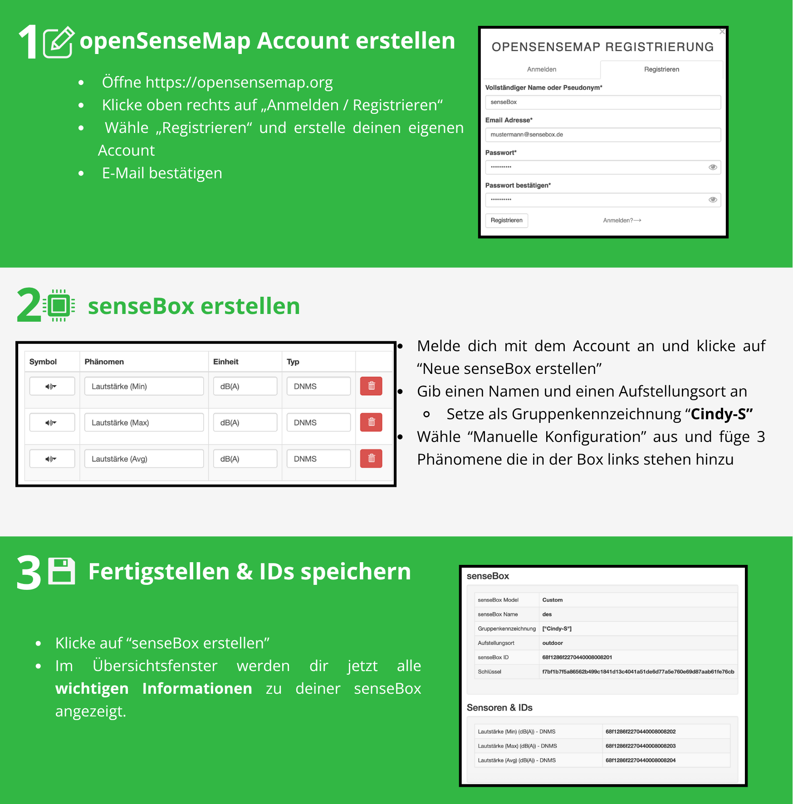
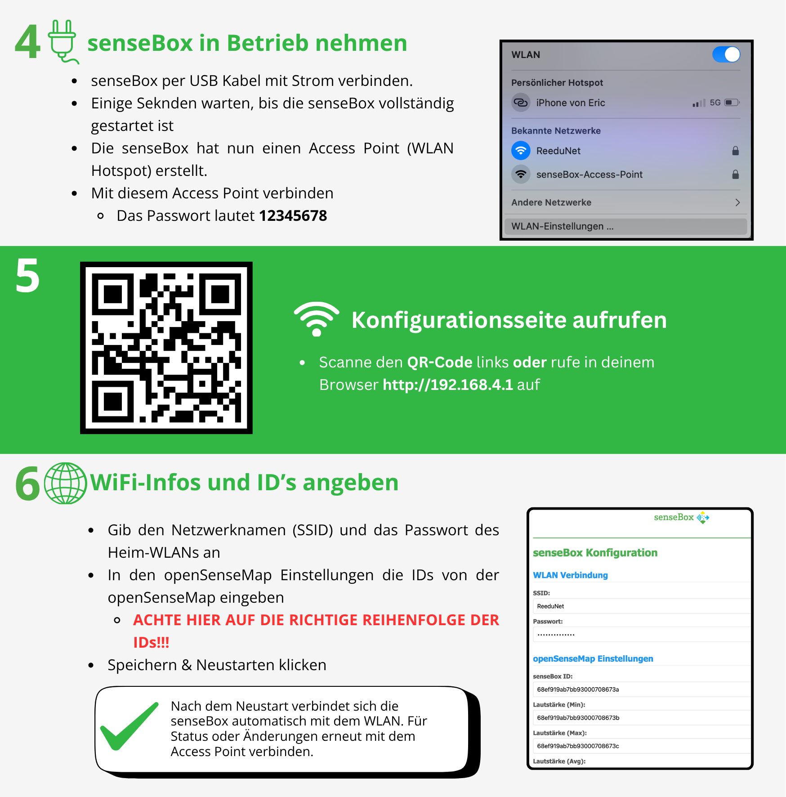

# senseBox Lautstärke-Logger

## Überblick

Dieses Projekt besteht aus drei Hauptkomponenten, die zusammen einen Lautstärke-Messpunkt für die OpenSenseMap ermöglichen:

1. **SoundSensor Bibliothek** - Liest Lautstärke-Werte von einem DNMS-Teensy
2. **SenseBox-Config-AP Bibliothek** - Konfiguriert WLAN und OpenSenseMap-Einstellungen
3. **Haupt-Sketch** - Sendet Messwerte an die OpenSenseMap

## Installation

1. **Bibliotheken installieren:**

   - `SoundSensor.zip` über Sketch → Bibliothek einbinden → .ZIP-Bibliothek hinzufügen
   - `SenseBox-Config-AP.zip` auf gleiche Weise

2. **Abhängigkeiten:**
   Diese Abhängigkeiten müssen noch über den Arduino Library Manager heruntergelaen werden !

   - ESP Async WebServer
   - ArduinoJson

3. **Sketch laden:**
   - Öffne `senseBox_dnms.ino`
   - Auf die senseBox-MCU-S2 per Arduion hochladen

## Verwendung

1. Gerät starten → "senseBox-AccessPoint" erscheint
2. Mit AP verbinden (PW: 12345678)
3. Seite öffnen: `192.168.4.1`
4. WLAN-Daten eingeben
5. OpenSenseMap-IDs eingeben
6. "Speichern & Neustarten" klicken
7. Gerät verbindet sich mit WLAN und sendet Messwerte

## Lizenz

MIT License - siehe einzelne Bibliotheken

## Materialien

Hier sind zwei Anleitungen zur Benutzung der senseBox. Diese können sich in Zukunft noch ändern und keine Finalen Versionen!

